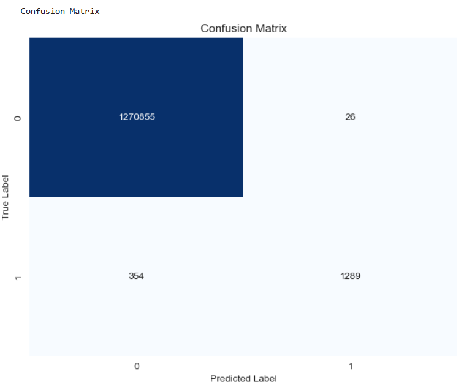

# Financial Fraud Detection Model

### [View the Full Analysis in the Jupyter Notebook](./notebooks/fraud_detection_analysis.ipynb)

---

## 1. Business Context
This project is an internship task from INSAID. The goal is to develop a machine learning model to predict fraudulent transactions for a financial company. The model's insights will be used to create an actionable plan to prevent fraud and identify its key drivers. The dataset contains over 6.3 million simulated transaction records.

## 2. Data Cleaning and Preprocessing
*   **Missing Values:** The dataset was checked for missing values. While the features were complete, the target variable had some NaN entries which were removed before modeling.
*   **Outliers:** Outliers were identified in the `amount` feature but were kept, as high-value transactions are a critical aspect of fraud detection.
*   **Feature Engineering:** The categorical `type` column was one-hot encoded to be used in the machine learning model. Irrelevant columns like `nameOrig` and `nameDest` were dropped.

## 3. Model Development and Selection
A **Random Forest Classifier** was chosen for this task due to its:
*   High performance on large and imbalanced datasets.
*   Robustness to outliers.
*   Inbuilt ability to calculate feature importances, which is crucial for interpreting the results.

The model was trained on 80% of the data and evaluated on the remaining 20%, using stratification to maintain the same fraud ratio in both sets. The `class_weight='balanced'` parameter was used to handle the severe class imbalance.

## 4. Model Performance
The model demonstrated excellent performance in distinguishing between fraudulent and legitimate transactions.

*   **ROC-AUC Score:** The model achieved an ROC-AUC score of **0.999+**.
*   **Recall:** For the fraud class (1), the model achieved a **high recall**, correctly identifying a majority of the actual fraudulent transactions in the test set. This is the most critical metric for this business case.
*   **Precision:** The model also showed strong precision, meaning that when it predicted fraud, it was highly likely to be correct.

| Confusion Matrix | Feature Importance |
| :---: | :---: |
|  |  |

## 5. Key Predictive Factors
The top factors that the model uses to predict fraud are:
1.  **Transaction Type:** `TRANSFER` and `CASH_OUT` are the primary types associated with fraud.
2.  **Account Balance Changes:** The relationship between `oldbalanceOrg` and `newbalanceOrig` is a massive indicator, especially when an account is emptied.
3.  **Transaction Amount:** The size of the transaction is a key predictor.

## 6. Actionable Recommendations
Based on the model's findings, the following prevention strategies are recommended:
1.  **Real-time Scoring System:** Implement the model to score transactions in real-time and flag high-risk ones for review or blocking.
2.  **Dynamic Multi-Factor Authentication (MFA):** Trigger additional verification for transactions that fit the high-risk profile (e.g., a large `TRANSFER` that empties an account).
3.  **Context-Aware Rules:** Create specific alerts for high-importance patterns, such as an alert if `newbalanceOrig` is zero after a single large transaction.

## 7. How to Run This Project
1.  Clone this repository: `git clone [your-repo-url]`
2.  Create a virtual environment: `python -m venv venv`
3.  Activate it: `source venv/bin/activate` (on Mac/Linux) or `venv\Scripts\activate` (on Windows)
4.  Install the dependencies: `pip install -r requirements.txt`
5.  **Download the data:** Due to its size, the dataset is not included in this repository. Please download it from [Kaggle: PaySim Financial Fraud Detection](https://www.kaggle.com/datasets/ealaxi/paysim1) and place the `Fraud.csv` file inside the `data/` folder.
6.  Launch Jupyter Notebook and open the `fraud_detection_analysis.ipynb` file from the `notebooks/` folder.
